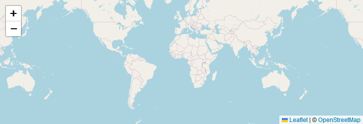
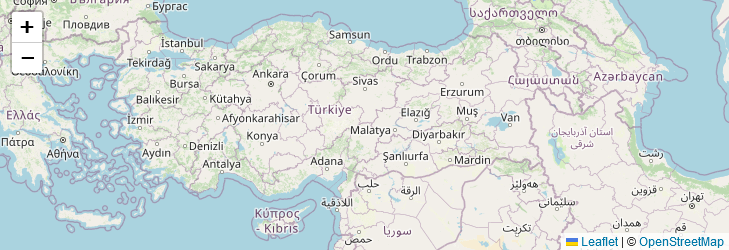

# Introduction 


## What is hyperleaflet?
Hyperleaflet is a library that allows you to use the popular Leaflet library with just *HTML attributes*. With Hyperleaflet, you can interact with Leaflet maps without writing a single line of JavaScript.
It offers a wide range of capabilities by wrapping Leaflet's most useful features in an opinionated yet versatile way.

Hyperleaflet designed to be a user-friendly Leaflet library that simplifies the creation of interactive maps for web pages or server-rendered HTML pages. This makes it a great choice for developers who want to create custom maps for web applications that require server-side rendering.

### What is Leaflet?

Leaflet is a popular JavaScript library by [Vladimir Agafonkin](https://agafonkin.com/) used for creating interactive maps on web pages. Leaflet already has a powerful and intuitive API that makes it easy to work with and customize maps to your specific needs. 


## Simple to use
!!! note "basic hyperleaflet steps"


    === "Add Map"

        

        ```html hl_lines="1 2"
        <div id="map">   
        </div>
        ```

    === "Add Center and Zoom"

        

        ```html hl_lines="1"
        <div id="map" data-center="38.5, 37.0" data-zoom="5">   
        </div>
        ```

    === "Add Tiles"

        

        ```html hl_lines="2 3"
        <div id="map" data-center="38.5, 37.0" data-zoom="5">   
        <div data-tile="OpenStreetMap" ></div>
        <div data-tile="EsriWorldImagery" data-max-zoom="19" data-min-zoom="5" data-default-tile></div>
        </div>
        ```

    === "Add Geometries"

        

        ```html hl_lines="4-11"
        <div id="map" data-center="38.5, 37.0" data-zoom="5">   
        <div data-tile="OpenStreetMap" data-default-tile></div>
        <div data-tile="EsriWorldImagery" data-max-zoom="19" data-min-zoom="5" ></div>
            <div hyperleaflet>
                <span data-id="1"
                data-geometry="[41.0,39.72]" data-geometry-type="Point">
                </span>
                <span data-id="2"
                data-geometry="[39.97,32.85]" data-geometry-type="Point">
                </span>
            </div>
        </div>
        ```
    === "Add Tooltip and Popups"

        

        ```html hl_lines="7 11"
        <div id="map" data-center="38.5, 37.0" data-zoom="5">   
        <div data-tile="OpenStreetMap" data-default-tile></div>
        <div data-tile="EsriWorldImagery" data-max-zoom="19" data-min-zoom="5" ></div>
            <div hyperleaflet>
                <span data-id="1"
                data-geometry="[41.0,39.72]" data-geometry-type="Point"
                data-popup="<h3>Trabzon</h3>" data-tooltip="1232" >
                </span>
                <span data-id="2"
                data-geometry="[39.97,32.85]" data-geometry-type="Point"
                data-popup="<h>Ankara</h>">
                </span>
            </div>
        </div>
        ```

## Try it yourself

 <iframe src="https://stackblitz.com/edit/hyperleaflet-demo?ctl=1&embed=1&file=index.html&hideDevTools=1&hideExplorer=1&hideNavigation=1" title="stackblitz" style="width: 100%; height: 500px" ></iframe> 


